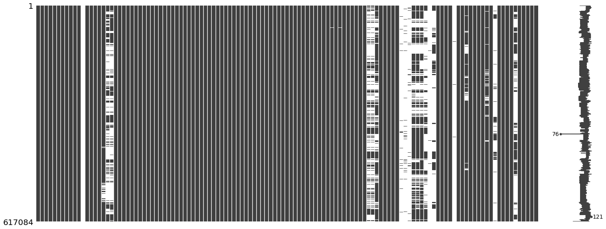
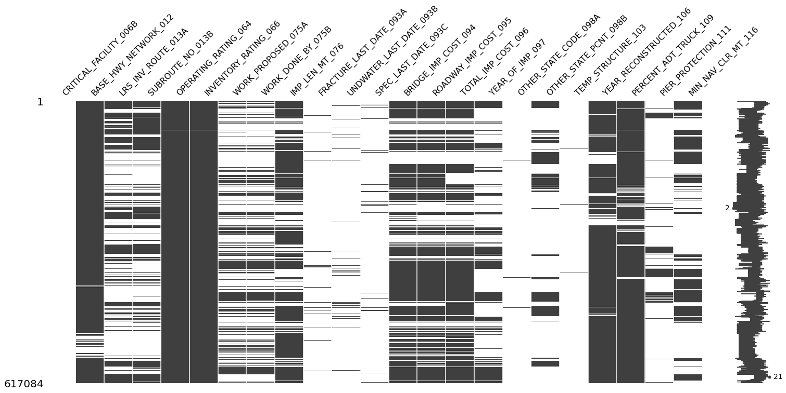
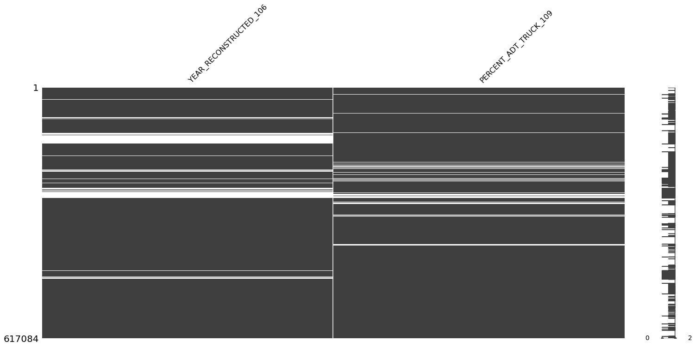
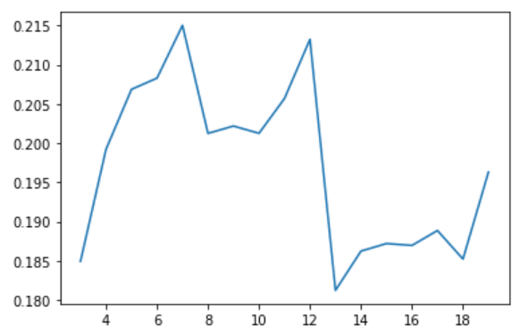
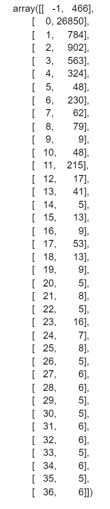
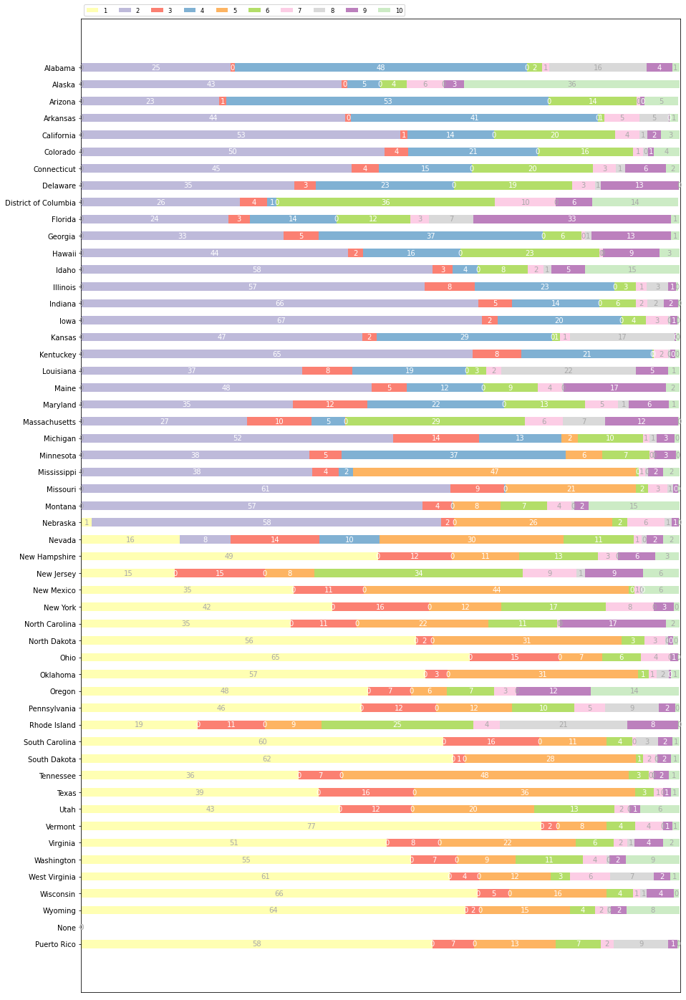
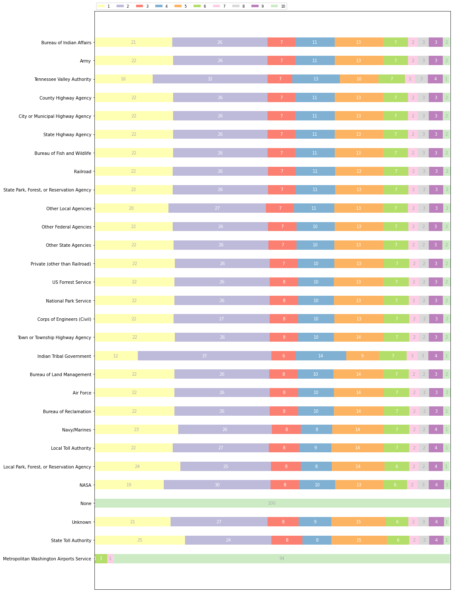
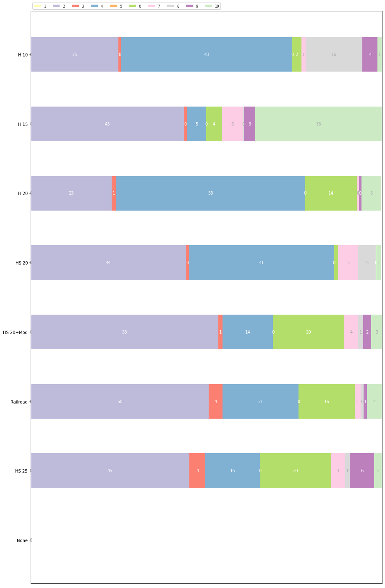
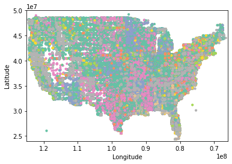
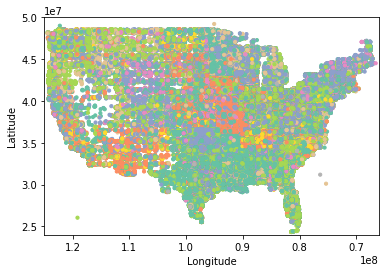

## Introduction/Background
Aging infrastructure in the United States is not only a safety concern, but an issue that costs taxpayers millions of dollars per year. Captured under the large umbrella of infrastructure is a network of over 600,000 bridges where nearly 40% are 50 years or older [1]. From the 2017 ASCE Infrastructure Report Card, it was determined that 9.1% of bridges are structurally deficient which translates to residents making an average of 188 million trips across structurally deficient bridges every day. These statistics are based on the bridge inspections conducted regularly and recorded in the National Bridge Inventory.
The National Bridge Inventory (NBI) is a publication of the United States Federal Highway Administration (FHWA) which provides records on the location, design, and condition of the nation’s bridge infrastructure. The 2019 NBI dataset provides over 600,000 individual bridge records, each with over 120 data dimensions. Records are available for each year since 1992, with standardized records available since 1995 when FHWA published Recoding and Coding Guide for the Structure Inventory and Appraisal of the Nation’s Bridges.

## Problem Definition 
The volume of available data over time and numerous, well defined dimensions allows for the application of several machine learning techniques to the NBI. Through unsupervised machine learning, this project will provide insight into the commonalities between bridges across differing geographic, jurisdictional, design, and condition descriptors, and the computational procedures for identifying outlier bridges from the database for further study. Supervised machine learning techniques will identify the most predictive factors for bridge deterioration and generate a fitted regression model for predicting bridge condition based on other factors. Specifically, these methods will allow researchers and transportation officials to predict the condition ratings of bridges before or without performing inspections. This could potentially reduce the needed inspection frequency for certain bridges, increase inspection frequency for critical bridges, and identify errors or jurisdictional inconsistencies in reporting bridge condition.
More broadly, we aim to create a tool to identify at-risk bridges based on the data from the NBI in order to prioritize or inform bridge inspections and their frequency, effectively prepare for the possible effects of natural disasters on at-risk bridges, and enable more efficient allocation of government infrastructure funding. Ultimately, this would create a safer network of bridges and build confidence in US infrastructure.

## Data Collection 
### Collection 
We are working with the 2019 NBI dataset published by the Federal Highway Administration for all the bridges across every state in the United States. This dataset is available as a .csv file on the FHWA webpage and contains a total of 617,0084 data points with 123 data dimensions. Much of the input formatting of this data predates widespread digital data recording and as such, some entries must be preprocessed to obtain a relevant meaning that can be used in machine learning algorithms. For example, the most recent bridge inspection date is encoded as a 3 or 4 digit number which represents the month and year of the most recent inspection.

### Initial Data Inspection
Figure 1 shows the distribution of missing values in our entire dataset, and Figure 2 shows only those features which contain missing values. Both figures demonstrate that select features are very sparse while others have a small number of missing features. The degree of sparsity was used in the feature selection process for subsequent models. Please refer to our linked NBI descriptors spreadsheet for an explanation of the features and the assessment of its relevance.  Those features which have a large number of missing features were determined to not be highly relevant to the determination of a bridge's integrity. 

{:height="100%" width="100%"}
*Figure 1. A bar chart of the raw data set where existing data is represented in gray and missing values are represented in white.*
 
{:height="100%" width="100%"}
*Figure 2. A bar chart of features which have missing values.*

### Feature Selection 
With 123 data dimensions, it is possible that there may be too many dimensions to obtain relevant results from machine learning algorithms or that the results may be deceptive and not reflect any actual field conditions. With this possibility in mind, the dimensions of the dataset were initially reduced to only those with a potentially relevant engineering meaning. This process is not to be confused with dimensionality reduction. The assessment of relevant features was based entirely on engineering judgement by members of the group who hold civil engineering degrees. While not perfect, there is reason to believe that this simplification improves the quality of the dataset. Each dimension and our assessment of its relevance can be found here. In general, dimensions related to administrative bureaucracy were discarded from the dataset (ex: route designation), alongside dimensions with no clear relationship to bridge condition (ex: clear distance between the abutments and vegetation).
 
Since the goal of this project is to predict condition scores based on other factors, the group selected the five condition scores: deck, superstructure, substructure, channel, and culvert to use as labels for supervised and semi supervised learning. These label conditions present a challenge. Conditions are ranked 0-9, however some conditions have a rank order with 9 representing excellent condition and 0 representing failure, while others do not have this ordered progression of conditions. Assessing and analyzing these scores is difficult to do with clustering algorithms but may lend itself well to future Bayes classification and regression models.
 
Below is a covariance heatmap for all of the relevant features and condition scores for our data. Features such as the year built, number of traffic lanes, structure type, scour critical values and high truck traffic values seems to have an impact of the condition scores for the bridge. This initial analysis uncovers relationships between features that might be important to consider as we conduct further work. 

{:height="100%" width="100%"}
*Figure 3. Covariance heatmap of selected relevant features and condition scores.*

### Cleaning 
After selecting the relevant features, features containing null values were identified. It was found that the Year Reconstructed and Percent Average Daily Traffic (ADT) of Trucks columns both had high numbers of null values (Figure 4). It was assumed that the Year Reconstructed null values meant that the bridge had never been reconstructed. For Percent ADT Truck we assumed null values signified a percentage of zero. After accounting for these null values and clearing the data for the remaining null values only 78 data points out of the more than 600,000 data points were lost.

{:height="100%" width="100%"}
*Figure 4. Bar chart of missing values for features Year Reconstructed and Percent ADT Truck.*

### Feature Engineering 
Some columns contained a mixture of integer and string values. For example, the scour critical values ranged from 0 to 9 and also contained values of N, U, or T. To adjust our data so that it contained only numeric representations, string values were mapped to numeric values not already contained within the original scale. Similar changes were made to the fracture, underwater inspection, and special inspection features. This ensured a completely numerical data set that did not contain any null values and was ready for analysis. 
 
### Normalization 
Because there are a wide variety of features, many of which have vastly different scales, it is important that the selected features are normalized. Some features have simple scales only a few digits in size, while other features, like location coordinates and age have much wider ranges. Normalization will ensure that each chosen feature has the same weight or contribution in each clustering calculation. 
 
### Mapping Functions
The data in the NBI is coded with short numerical or alphabetical codes representing complex strings or slightly different numerical values depending on the context. To get around this issue, mapping functions were created for each relevant data dimension that relates the code in the NBI dataset to its literal meaning. For example, the NBI codes for longitude and latitude which are present in the dataset as a series of eight or nine digits ([x]xxxxxxxx), represent the geographical coordinates of the bridge in the format [x]xx degrees, xx minutes, xx.xx seconds. This information needs to be properly processed by converting it to decimal degrees before it can be meaningful in any algorithm. Some information is not as complex to decode. An example of this would be the type of structural system of each bridge which is a two digit number that maps directly to a string description of the structure type. These functions are critical for interpreting the results of clustering and other algorithms.

## Methods 
### Unsupervised
Several unsupervised clustering approaches including KMeans and DBSCAN have been applied. The motivation behind using clustering is that clusters may provide insight into common features among various groups of bridges. 

### KMeans
The first clustering attempt uses KMeans as it is one of the simplest clustering algorithms available. This implementation uses the scikit learn clustering library, where a fixed number of clusters can be specified for the algorithm to compute clusters for each datapoint. 

The optimal number of clusters is unknown, therefore iteration over possible numbers of clusters to determine which might be best to use was executed. First, KMeans was run on our dataset, which takes each datapoint and assigns it to the nearest centroid k. This was repeated for each point. Then the resulting cluster labels for each point are compared with the original data using a silhouette coefficient. This is recorded for each step and the process is restarted with k+1 fixed clusters. After many iterations, the silhouette coefficients are graphed and compared to find the maximum value. The maximum value indicates the cluster k with highest cohesion and separation. This clustering is then used with fixed max k for further analysis.

{:height="100%" width="100%"}
*Figure 5. Plot of silhouette coefficients vs number of clusters.*

### DBSCAN
The second attempt at clustering uses a density based clustering approach. Due to the nature of density based clustering, this approach may help us detect anomalies in the dataset, where sets of bridges stand far apart from the majority. It is important to examine each of these clusters to determine the reason for separate clustering. This could provide insight into feature groups that predict poor bridge integrity. 

First attempts at density clustering indicate that there is in fact a majority of clusters holding most bridges and a minority of clusters holding outlier bridges. Again, the scikit learn implementation of DBSCAN was used to perform clustering. In this implementation, epsilon values for maximum distance must be defined. A common epsilon value of .5 was used to start and plan to test best fit for a range of epsilon values shortly to select the best value for further analysis. Figure 6 shows a frequency mapping of initial DBSCAN methods. 

{:height="100%" width="100%"}
*Figure 6. Frequency mapping of initial DBSCAN methods.*

## Results
### Unsupervised
The following are the visualization of results from KMeans clustering. The motivation behind using clustering is that clusters may provide insight into common features among various groups of bridges.

### KMeans 
Figures 7 through 10 are visualizations of results from KMeans clustering. In particular, Figure 8 is an example of successfully incorporating jurisdictional features in a clustering algorithm; the bridges’ owner is not at all predictive of what cluster the bridge may fall into. Figure 10 is a representation of the clusters produced by KMeans clustering. Inter-state as well as intra-state geographic clustering is an encouraging result that suggests that environmental as well as jurisdictional factors are influencing the clustering algorithm. Further analysis will attempt to explain these influences. Also interestingly, the clusters shown in Figure 10 do not necessarily match well with Figure 11 which shows bridges by their structure type. This is a positive result and indicates that clustering is working beyond obvious distinguishing characteristics.

{:height="100%" width="100%"}
*Figure 7. Visualization of KMeans clustering by state.*

{:height="100%" width="100%"}
Figure 8. Visualization of KMeans clustering by owner.

{:height="100%" width="100%"}
Figure 9. Visualization of KMeans clustering by design load type.

{:height="100%" width="100%"}
Figure 10. Visualization of KMeans clustering by geographic location.

{:height="100%" width="100%"}
Figure 11. Visualization of structure type by geographic location.

## Discussion
Initial clustering evaluation has shown that some structural and loading features are able to create meaningful clustering relationships as evidenced in the latitude-longitude scatter plots (Figures 10 and 11). However, clustering appears to be more sensitive to juristitional distinctions than anticipated. An example of this is the clustering by states shown for KMeans clustering (Figure 7). The largest two clusters are distinguished by states ranked in alphabetical (and therefore numerical) order. This indicates that these two groups are being clustered predominantly by their alphabetical proximity to other states, which is not meaningful from an engineering standpoint. Future clustering may choose to treat these features as labels and not as dimensions for clustering. The labeling will then be used to assess whether structural and loading features are predicted by jurisdictional location. Regardless, further analysis of the results of clustering is needed to determine the best algorithms and dimensions to use in generating meaningful clusters. One method through which we can analyze our clustering algorithms is to utilize the bridge condition scores as ground truth values and perform matching based measures such as purity and maximum matching. 
Future work will use supervised learning techniques to predict bridge condition scores based on other features of the NBI dataset. The supervised learning techniques we plan on utilizing in the future include ANN, SVM, and random forests. 

## References 
[1] ASCE's 2017 Infrastructure Report Card. 2017. Bridges. [online] Available at: <https://www.infrastructurereportcard.org/cat-item/bridges/> [Accessed: 5 November 2020].
[2] “Public Disclosure of National Bridge Inventory (NBI) Data - National Bridge Inventory - Bridge Inspection - Safety - Bridges & Structures - Federal Highway Administration.” [Online]. Available: https://www.fhwa.dot.gov/bridge/nbi/20070517.cfm. [Accessed: 5 November 2020].
